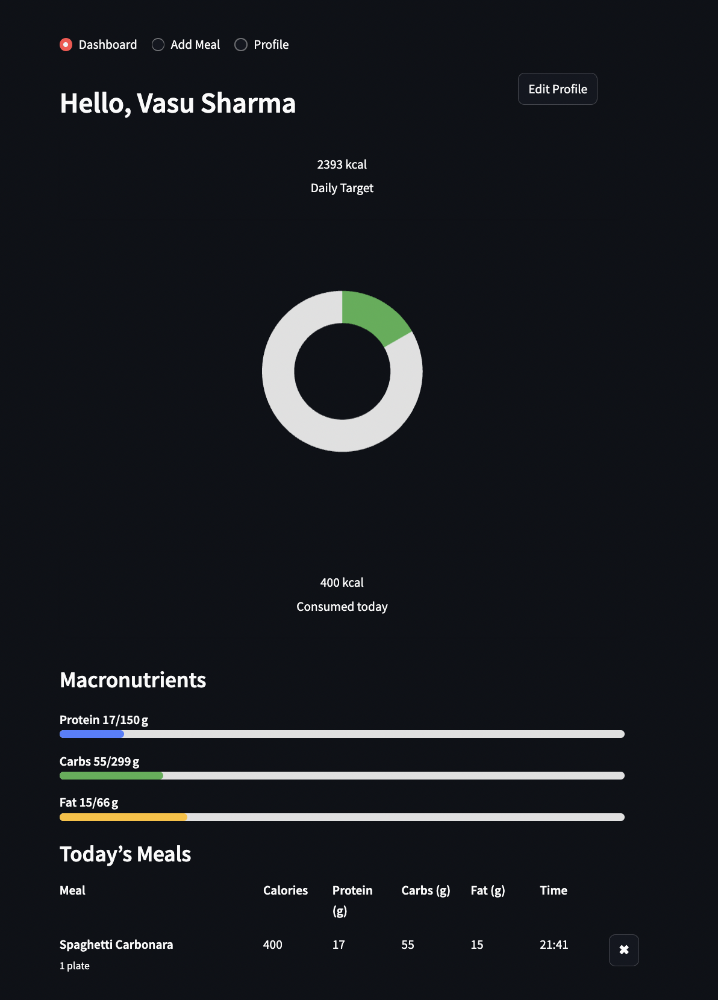

# 🍽️ NutriSnap

**NutriSnap** is a photo‑based calorie & macro tracker built with **Streamlit**  
and **GPT‑4o Vision**.  Snap a picture of your meal, let the AI identify the dish
( or verify the name you type ), estimate its calories + macros, and log it to
a lightweight local database.  A single‑file app for quick local use or
internal demos.

<p align="center">
  
</p>

---

## ✨ Features

| | |
| :-- | :-- |
| 🔍 **Auto‑identify meals** | GPT‑4o names the dish if you leave the description blank, or confirms / corrects the name you provide. |
| 📸 **Vision‑powered nutrition** | Returns calories, protein, carbs, fat, fibre & sugar from the uploaded photo. |
| 🔄 **Persistent daily log** | Meals are stored in a local **SQLite** db (`nutrition_log.db`). |
| 🎯 **Personalised goals** | Calculates BMR (Mifflin‑St Jeor) → TDEE with activity & goal multipliers. |
| 🍩 **Visual dashboard** | Donut chart for calories, progress bars for macros, editable meal table with delete icons. |
| 🔑 **Single file** | `nutrisnap_app.py` – easy to read, fork and extend. |
| 🌗 **Theme‑aware UI** | Adapts automatically to light & dark Streamlit themes. |

---

## 🚀 Quick start

```bash
# 1. clone or copy the repo
git clone https://github.com/your-user/nutrisnap.git
cd nutrisnap

# 2. create a fresh env (optional but recommended)
python -m venv .venv
source .venv/bin/activate   # Windows: .venv\Scripts\activate

# 3. install requirements
pip install streamlit openai pillow pandas altair

# 4. set your OpenAI key (GPT‑4o Vision access required)
export OPENAI_API_KEY="sk‑proj‑…"

# 5. run the app
streamlit run nutrisnap_app.py
# NutriSnap
Multimodal Nutrition Tracking App
